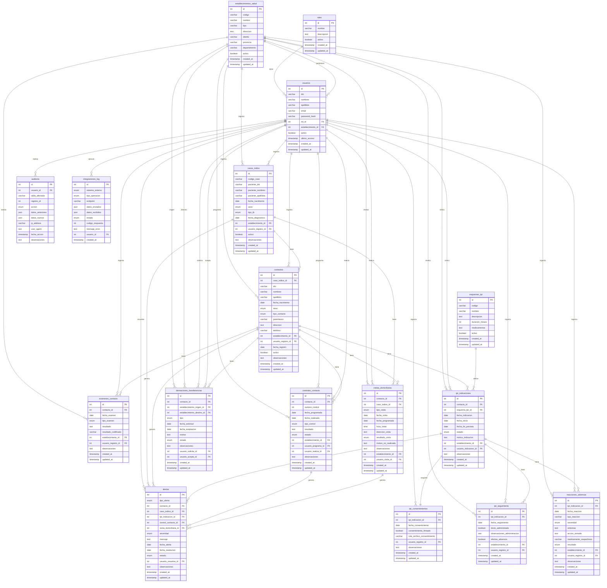

# Base de Datos - Sistema de Monitoreo de Tuberculosis

Este directorio contiene el esquema y scripts de inicialización de la base de datos MySQL para el sistema de monitoreo de tuberculosis.

## Estructura de Archivos

- `schema.sql`: Esquema completo de la base de datos con todas las tablas, relaciones e índices
- `init_data.sql`: Datos iniciales y de ejemplo para desarrollo y pruebas
- `README.md`: Esta documentación

## Arquitectura del Backend

El backend está implementado con Node.js y sigue una arquitectura en capas:

### Tecnologías Utilizadas

- **Framework**: Koa.js 2.x
- **ORM**: Sequelize 6.x
- **Base de datos**: MySQL 8.0+
- **Autenticación**: JWT (JSON Web Tokens)
- **Documentación**: Swagger/OpenAPI con Swagger UI
- **Seguridad**: bcrypt para hash de contraseñas, Helmet para seguridad HTTP

### Estructura del Proyecto

```
service/
├── src/
│   ├── config/          # Configuración (JWT, Swagger, etc.)
│   ├── controllers/      # Controladores HTTP (manejo de requests/responses)
│   ├── services/        # Lógica de negocio
│   ├── repositories/    # Acceso a datos (Sequelize)
│   ├── models/          # Modelos Sequelize (definición de tablas)
│   ├── routes/          # Definición de rutas API
│   ├── middleware/      # Middleware (auth, error handling, audit)
│   └── index.js         # Punto de entrada de la aplicación
├── package.json
└── env.example          # Variables de entorno de ejemplo
```

### Flujo de Datos

```
Request → Routes → Controllers → Services → Repositories → Models → Database
                                                              ↓
Response ← Routes ← Controllers ← Services ← Repositories ← Models ← Database
```

## Requisitos

- MySQL 8.0 o superior
- Usuario con permisos para crear bases de datos y tablas

## Instalación

### 1. Crear la base de datos

```bash
mysql -u root -p < database/schema.sql
```

### 2. Cargar datos iniciales (opcional)

```bash
mysql -u root -p tbc_monitoring < database/init_data.sql
```

O desde MySQL:

```sql
SOURCE database/schema.sql;
SOURCE database/init_data.sql;
```

## Estructura de la Base de Datos

### Tablas Principales

#### 1. **Gestión de Usuarios y Seguridad (RNF-01)**
- `roles`: Roles del sistema (Médico, Enfermería, Trabajador Social, etc.)
- `usuarios`: Usuarios del sistema con autenticación
- `establecimientos_salud`: Establecimientos de salud del sistema

#### 2. **Casos Índice**
- `casos_indice`: Pacientes con TB confirmada

#### 3. **Contactos (RF-01)**
- `contactos`: Registro nominal de contactos (intradomiciliarios y extradomiciliarios)

#### 4. **Exámenes (RF-02)**
- `examenes_contacto`: Registro de exámenes integrales (clínico, radiológico, inmunológico, bacteriológico)

#### 5. **Controles (RF-03)**
- `controles_contacto`: Programación y registro de controles según tipo de TB del caso índice

#### 6. **Terapia Preventiva - TPT (RF-04, RF-05)**
- `esquemas_tpt`: Esquemas de tratamiento preventivo disponibles
- `tpt_indicaciones`: Indicaciones de TPT para contactos
- `tpt_consentimientos`: Registro de consentimiento informado (Anexo N°9)
- `tpt_seguimiento`: Seguimiento y registro de administración de TPT

#### 7. **Reacciones Adversas (RF-06)**
- `reacciones_adversas`: Notificación y seguimiento de RAM (Anexo N°13)

#### 8. **Visitas Domiciliarias (RF-08)**
- `visitas_domiciliarias`: Registro de visitas (primer contacto y seguimiento)

#### 9. **Derivaciones y Transferencias (RF-09)**
- `derivaciones_transferencias`: Derivación y transferencia entre establecimientos

#### 10. **Alertas (RF-10)**
- `alertas`: Alertas por incumplimiento de controles o TPT

#### 11. **Auditoría (RNF-03)**
- `auditoria`: Registro de auditoría y trazabilidad de todas las acciones

#### 12. **Integraciones (RF-07, RNF-02)**
- `integraciones_log`: Log de integraciones con SIGTB y NETLAB

## Esquema de Base de Datos



## Relaciones Principales

```
casos_indice (1) ──< (N) contactos
contactos (1) ──< (N) examenes_contacto
contactos (1) ──< (N) controles_contacto
contactos (1) ──< (N) tpt_indicaciones
tpt_indicaciones (1) ──< (N) tpt_seguimiento
tpt_indicaciones (1) ──< (N) reacciones_adversas
contactos (1) ──< (N) visitas_domiciliarias
contactos (1) ──< (N) derivaciones_transferencias
```

## Características de Seguridad

- **Encriptación de contraseñas**: Las contraseñas se almacenan como hash usando bcrypt (implementado en el backend)
- **Autenticación JWT**: Sistema de tokens JWT para autenticación de usuarios (implementado)
- **Auditoría completa**: Todas las acciones se registran en la tabla `auditoria` (tabla creada, endpoints pendientes)
- **Roles y permisos**: Sistema de roles para control de acceso (RNF-01) - Middleware de autorización implementado
- **Trazabilidad**: Registro de usuario que realiza cada acción en todas las tablas
- **Soft Deletes**: Eliminación lógica usando campo `activo` en lugar de eliminación física
- **Validación de datos**: Validación a nivel de base de datos y aplicación (Sequelize)

## Documentación de la API

El backend incluye documentación interactiva con Swagger/OpenAPI:

- **URL de documentación**: `http://localhost:3000/api-docs` (cuando el servidor esté ejecutándose)
- **Formato**: Swagger UI con especificación OpenAPI 3.0
- **Autenticación**: Los endpoints protegidos requieren token JWT en el header `Authorization: Bearer <token>`

## Notas Importantes

1. **Contraseñas de ejemplo**: Los usuarios en `init_data.sql` tienen contraseñas de ejemplo. **DEBEN ser cambiadas en producción**.

2. **Índices**: Se han creado índices en campos frecuentemente consultados para optimizar el rendimiento.

3. **Charset**: Se usa `utf8mb4` para soportar caracteres especiales y emojis.

4. **Foreign Keys**: Se usan restricciones de integridad referencial para mantener la consistencia de datos.

5. **Soft Deletes**: Muchas tablas tienen un campo `activo` para implementar borrado lógico en lugar de físico.

## Estado de Implementación del Backend

> **Nota**: Para información detallada sobre los endpoints implementados, ver [`../service/README.md`](../service/README.md)

### Resumen de Cobertura

- **Tablas con endpoints completos**: 17/17 (100%) ✅
- **Tablas con endpoints parciales**: 0/17
- **Tablas sin endpoints**: 0/17

**Nota**: ✅ **TODOS los endpoints están implementados**. Todas las tablas funcionales tienen endpoints completos. Las tablas de logging (`auditoria` e `integraciones_log`) tienen endpoints de consulta para administradores.

### Endpoints Principales por Categoría

#### Funcionalidades Core
- ✅ Casos Índice - CRUD completo
- ✅ Contactos (RF-01) - CRUD completo
- ✅ Exámenes de Contacto (RF-02) - CRUD completo
- ✅ Controles de Contacto (RF-03) - CRUD completo
- ✅ TPT - Indicaciones, Consentimientos, Seguimiento (RF-04, RF-05) - CRUD completo
- ✅ Reacciones Adversas (RF-06) - CRUD completo
- ✅ Visitas Domiciliarias (RF-08) - CRUD completo
- ✅ Derivaciones/Transferencias (RF-09) - CRUD completo
- ✅ Alertas (RF-10) - CRUD completo

#### Gestión y Administración
- ✅ Autenticación - Login y perfil de usuario
- ✅ Gestión de Usuarios - CRUD completo
- ✅ Gestión de Roles - CRUD completo
- ✅ Establecimientos de Salud - CRUD completo
- ✅ Auditoría (RNF-03) - Consulta de registros
- ✅ Integraciones (RF-07, RNF-02) - Logs y consultas a sistemas externos

**Para ver la lista completa de endpoints con detalles, consulta [`../service/README.md`](../service/README.md#-endpoints-de-la-api)**

### Resumen de Cobertura

- **Tablas con endpoints completos**: 17/17 (100%) ✅
- **Tablas con endpoints parciales**: 0/17
- **Tablas sin endpoints**: 0/17

**Nota**: ✅ **TODOS los endpoints están implementados**. Todas las tablas funcionales tienen endpoints completos. Las tablas de logging (`auditoria` e `integraciones_log`) tienen endpoints de consulta para administradores.

## Tareas Completadas ✅

### Funcionalidades Implementadas

1. ✅ **Endpoints de Gestión de Usuarios**
   - CRUD completo de usuarios (`/api/usuarios`)
   - Cambio de contraseña (`PUT /api/usuarios/:id/cambiar-password`)
   - Búsqueda y filtrado de usuarios
   - Paginación

2. ✅ **Endpoints de Gestión de Roles**
   - CRUD completo de roles (`/api/roles`)
   - Listado con búsqueda y filtros
   - Validación de nombres únicos

3. ✅ **Endpoints de Auditoría**
   - Consulta de registros de auditoría (`/api/auditoria`)
   - Filtros por usuario, tabla, fecha, acción
   - Consulta por usuario específico
   - Consulta por tabla específica

4. ✅ **Validación de Datos**
   - Middleware de validación con Joi
   - Validación de requests en endpoints
   - Mensajes de error estructurados

5. ✅ **Migraciones de Base de Datos**
   - Configuración de Sequelize CLI
   - Archivo `.sequelizerc` configurado
   - Configuración de entornos (development, test, production)

6. ✅ **Seguridad Adicional**
   - Rate limiting implementado (100 req/min por IP)
   - Rate limiting estricto para login (5 intentos/15 min)
   - Middleware de validación de datos

7. ✅ **Endpoints de Integraciones**
   - CRUD completo de logs de integraciones (`/api/integraciones-log`)
   - Consulta de logs por sistema externo
   - Endpoints para consultar SIGTB (`POST /api/integraciones/sigtb/consultar`)
   - Endpoints para consultar NETLAB (`POST /api/integraciones/netlab/consultar`)
   - Logging automático de todas las operaciones de integración
   - Estructura lista para implementar llamadas reales cuando se tengan las credenciales

## Tareas Pendientes / Mejoras Futuras

### Funcionalidades Faltantes

1. ✅ **Endpoints de Integraciones** (Completado)
   - ✅ Consulta de logs de integraciones
   - ✅ Estructura para integración con SIGTB (RF-07) - Lista para implementar llamadas reales
   - ✅ Estructura para integración con NETLAB (RNF-02) - Lista para implementar llamadas reales
   
   **Nota**: Los servicios de integración están implementados con estructura completa. Solo falta configurar las URLs y credenciales reales de SIGTB y NETLAB en las variables de entorno cuando estén disponibles.

### Mejoras Técnicas

2. **Stored Procedures** (Opcional)
   - Si se requieren consultas complejas optimizadas
   - Procedimientos para reportes específicos

3. **Backups Automáticos**
   - Configurar backups programados de la base de datos
   - Estrategia de retención de backups

4. **Testing**
   - Tests unitarios para servicios y repositorios
   - Tests de integración para endpoints
   - Tests de carga

5. **Mejoras de Seguridad**
   - Implementar validación Joi en todos los endpoints
   - Logging de seguridad más detallado
   - Monitoreo de intentos de acceso sospechosos

## Referencias Normativas

- **RF-01**: 5.2.13, 6.1.1.2.A - Censo de contactos
- **RF-02**: 5.2.13, 6.1.1.2.A - Examen integral
- **RF-03**: 6.1.1.2.A - Control de contactos
- **RF-04**: 6.1.1.2.B - Tablas N°2 a N°7
- **RF-05**: 6.1.1.2.B - Procedimientos para TPT
- **RF-06**: 6.1.2.3 - Formato Anexo N°13
- **RF-07**: 5.2.38 - Sistema nominal de gestión
- **RF-08**: 6.4.2.1.b.iii - Anexo N°15
- **RF-09**: 5.2.21, 5.2.42 - Flujos de referencia
- **RF-10**: 6.4.2.1.b.v - Prevención de pérdida de seguimiento
- **RNF-01**: 5.7 - Protección de datos personales
- **RNF-03**: 5.7 - Confidencialidad y Ley 29733
